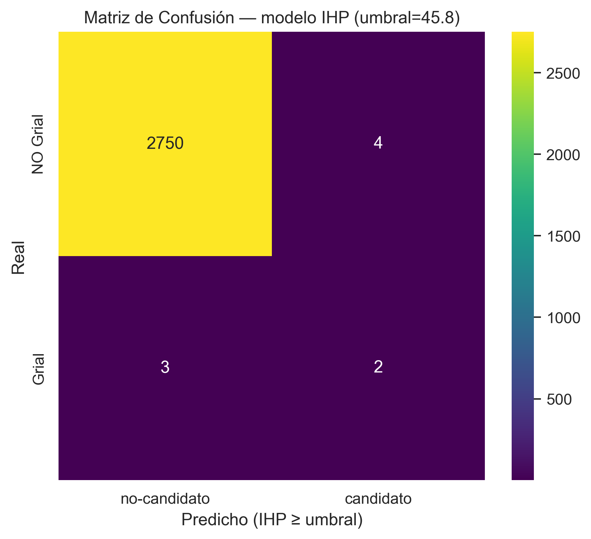
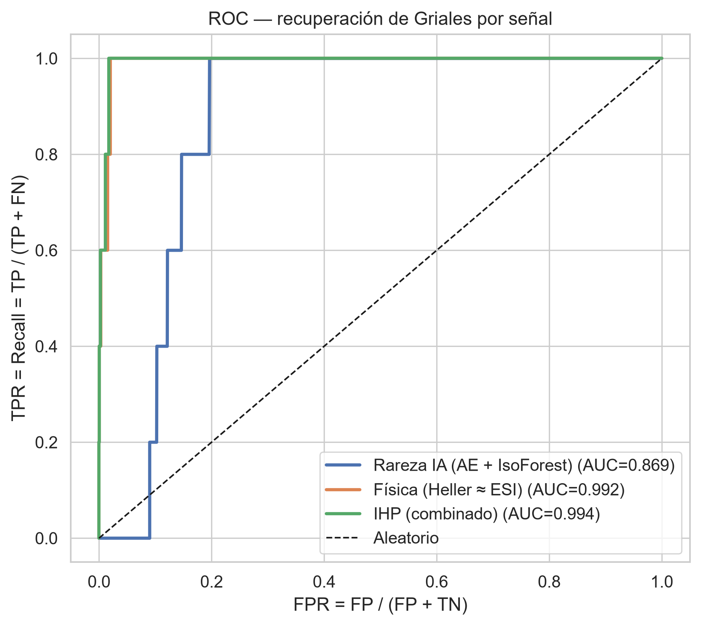
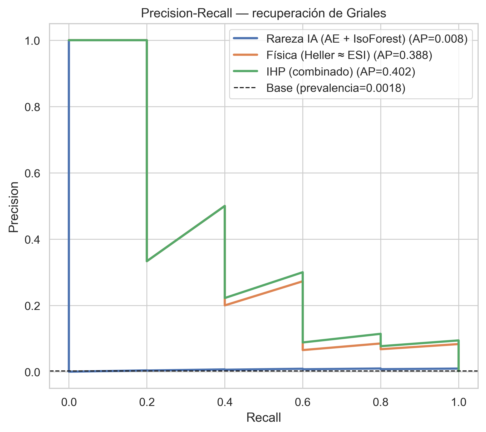
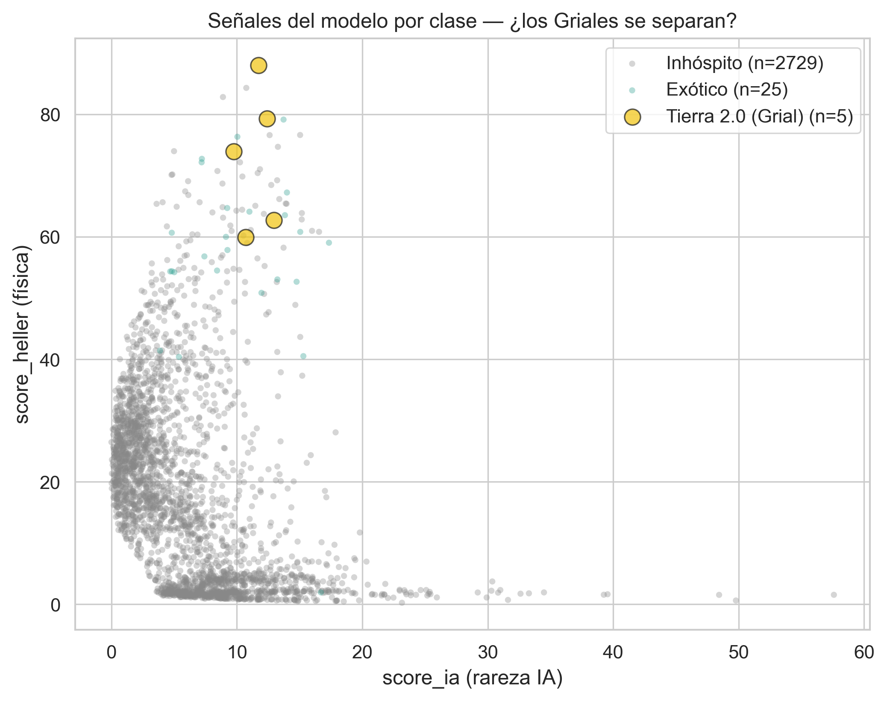

# Informe de Métricas de Validación — Astronomus (Clase #8)

**Fecha:** 2026-06-17 · **Rama:** `Sandbox-metricas`
**Modelo evaluado:** pipeline no supervisado de detección de anomalías + ranking
(`backend/src/models/train.py`): Autoencoder ponderado por física + Isolation Forest
(`score_ia`) combinados con un índice de Heller (`score_heller`) en el **IHP** (Índice de
Habitabilidad Planetaria).

> Documento único: contiene todas las métricas del apunte (Clase #8) con sus tablas y gráficos.
> Los `.csv` y el `.txt` en esta carpeta son la exportación cruda de estos mismos números.

**Qué se hizo en la sesión:** (1) se generó la Capa Oro (`py main.py --all`); (2) se
corrió el modelo real (`py backend/src/models/train.py` → `ranking_anomalias.csv` +
`astronomus_ae.pth`); (3) se escribió `backend/tests/Simple/M8_metricas_anomalias.py`, que
calcula y exporta todas las métricas de validación apropiadas para un modelo de **ranking**.

---

## 0. Contexto de la evaluación

- **Universo etiquetado:** 2.759 planetas con etiqueta PHL — clase 0 (Inhóspito)=2.729,
  clase 1 (Exótico)=25, **clase 2 (Tierra 2.0 / Grial)=5**.
- **Catálogo total rankeado:** 6.278 planetas.
- Los **5 Griales quedan FUERA del entrenamiento** → validación held-out legítima.
- Es un problema de **ranking/recuperación**, no de clasificación plana: las métricas
  principales son AUC, PR-AUC y Recall@k; la matriz de confusión/Accuracy son el puente al apunte.

---

## 1. Confusion Matrix (Clase #8 · §02)

Decisión binaria por umbral del modelo (cuantil 0.96 del IHP > 0 → **umbral = 45.81**):
"¿es un candidato excepcional?".

|  | pred: no-candidato | pred: candidato |
|---|:---:|:---:|
| **real: NO Grial** | 2750 (TN) | 4 (FP) |
| **real: Grial** | 3 (FN) | 2 (TP) |



---

## 2. Accuracy · Precision · Recall · F1 (Clase #8 · §03–06)

| Métrica | Fórmula | Valor |
|---|---|:---:|
| Accuracy | (TP+TN)/Total | **0.9975** |
| Precision | TP/(TP+FP) | 0.3333 |
| Recall | TP/(TP+FN) | 0.4000 |
| F1-Score | 2·P·R/(P+R) | 0.3636 |

> ⚠️ **La "trampa del Accuracy"** (apunte pág. 14): 0.9975 es altísimo solo porque el 99.8% de
> los planetas no son Griales. Un modelo que dijera "ninguno es Grial" daría casi lo mismo. Por
> eso acá mandan F1, Recall y AUC.

---

## 3. Curva ROC y AUC (Clase #8 · §08)

Poder de ranking para recuperar los Griales, por cada señal del modelo:

| Señal | ROC-AUC | PR-AUC |
|---|:---:|:---:|
| Rareza IA (AE + IsoForest) | 0.869 | 0.008 |
| Física (Heller ≈ ESI) | 0.992 | 0.388 |
| **IHP (combinado)** | **0.994** | **0.402** |





---

## 4. Recuperación de Griales (Precision@k / Recall@k)

Rankeando el universo etiquetado por IHP:

| k | Griales en top-k | Precision@k | Recall@k |
|:---:|:---:|:---:|:---:|
| 10 | 3 | 0.30 | 0.60 |
| 20 | 3 | 0.15 | 0.60 |
| 50 | 4 | 0.08 | 0.80 |
| 100 | 5 | 0.05 | **1.00** |

**Posición de los 5 Griales conocidos** (ranking por IHP, de 2.759):

| Planeta | IHP | Rank | Percentil |
|---|:---:|:---:|:---:|
| Kepler-442 b | 49.86 | 1 | 100.0% |
| Kepler-1652 b | 45.88 | 4 | 99.9% |
| Kepler-452 b | 41.77 | 10 | 99.6% |
| GJ 1061 b | 37.84 | 35 | 98.7% |
| GJ 273 c | 35.30 | 53 | 98.1% |

Los 5 caen en el **top-100** (percentil ≥ 98.1%): el modelo los surfacea muy arriba.

---

## 5. R² Score (Clase #8 · §07 — vista regresión)

El modelo no es un regresor, pero su score es continuo: se mide cuánta varianza del **ESI**
(target continuo) explica un ajuste lineal de cada señal (R²=1 perfecto, R²=0 no explica nada).

| Señal | R² (vs ESI) |
|---|:---:|
| Rareza IA (AE + IsoForest) | 0.037 |
| Física (Heller ≈ ESI) | 0.598 |
| IHP (combinado) | 0.270 |

---

## 6. Lectura honesta — ¿quién hace el trabajo?

El IHP rankea los Griales **casi perfecto (ROC-AUC 0.99)** y como buscador de candidatos
funciona muy bien. Pero las métricas revelan **por qué**:

- `score_heller` (física): AUC **0.992**, R² vs ESI **0.598**, correlación **+0.77** con el ESI.
- `score_ia` (IA no supervisada): AUC **0.869**, R² vs ESI **0.037**, correlación **−0.19**.

El índice de Heller usa la **misma física que el ESI**, y el Grial se **define** por ESI ≥ 0.80.
Es decir: **el que "encuentra" los Griales es mayormente la fórmula física (casi circular), no
el autoencoder.** La IA no supervisada aporta señal pero es la más débil — el mérito está en la
ingeniería de features físicos más que en el deep learning.



**Caveat estadístico:** con solo **5 Griales** las métricas tienen alta varianza; el PR-AUC bajo
(0.40) refleja la rareza extrema (precision intrínsecamente baja), no un fallo del ranking.

---

## 7. Reproducir

```powershell
# (rama Sandbox-metricas, desde la raíz, con .venv activado)
py main.py --all                              # Capa Oro (X_scaled.csv, y.csv)
py backend/src/models/train.py                        # modelo -> ranking_anomalias.csv
py backend/tests/Simple/M8_metricas_anomalias.py      # genera este informe (CSVs + figuras)
```

**Artefactos:** `backend/artifacts/models/astronomus_ae.pth` (modelo),
`ranking_anomalias.csv` (ranking completo). **Datos crudos de este informe:**
`anomalias_metricas.txt`, `anomalias_auc.csv`, `anomalias_precision_at_k.csv`,
`anomalias_clasificacion.csv`, `anomalias_r2.csv`, `anomalias_matriz_confusion.csv`.
